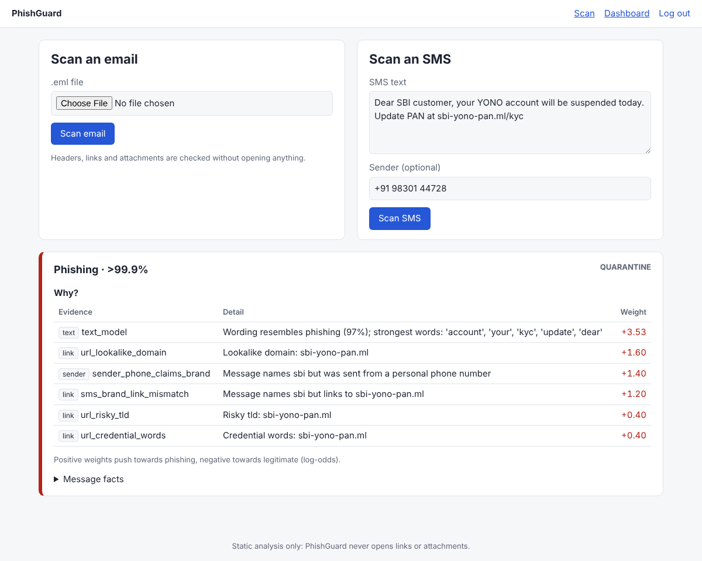
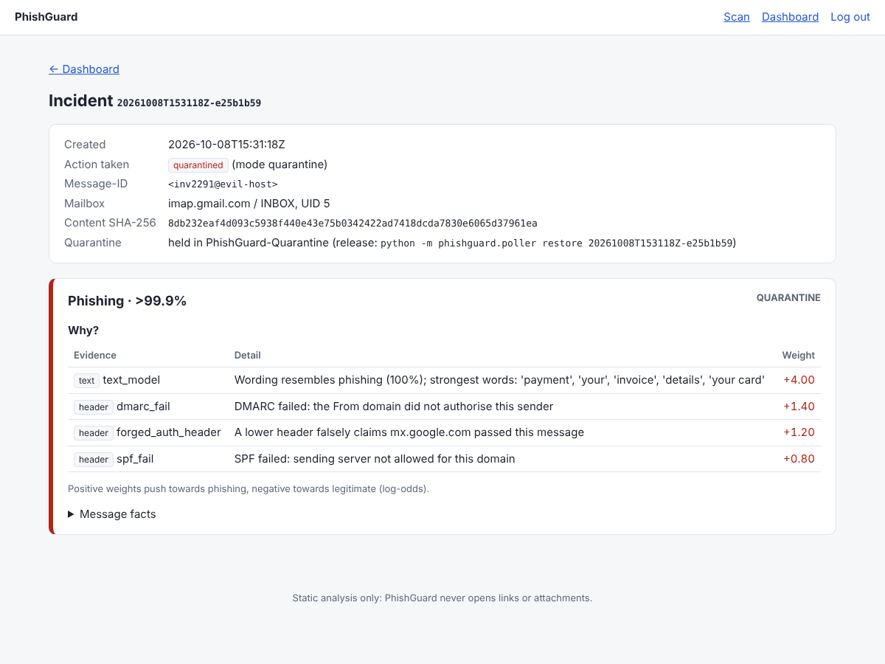

# PhishGuard: AI-Based Phishing Detection Tool

> 🚧 Work in progress: a 10-day build of an explainable phishing detector for email and SMS.

AI has made scams look genuine: phishing emails now have perfect grammar and are
personalised at scale. PhishGuard combines **technical evidence AI can't fake**
(SPF/DKIM/DMARC results, spoofed senders, lookalike links) with a **machine-learning
model of scam intent**. It explains every verdict and can automatically quarantine
phishing from your own mailbox.

## Planned features
- 📥 Automatic scanning of your own Gmail over IMAP, plus `.eml` upload and SMS text
- 🔍 Header checks (SPF/DKIM/DMARC, Reply-To mismatch, display-name spoofing)
- 🔗 URL checks (punycode, IP hosts, `@` tricks, shorteners, link-text mismatch)
- 🤖 TF-IDF + Logistic Regression models for email and SMS
- 💡 Explainable verdicts ("why was this flagged?")
- 🛡️ Reversible quarantine with JSON incident reports and an audit log
- 📊 Login-protected, read-only admin dashboard

## Progress
- [x] Day 1: Project setup, secure repo hygiene, config validation
- [x] Day 2: Safe `.eml` parser (size, MIME-bomb, header-flood and charset defences)
- [x] Day 3: Header checks (SPF/DKIM/DMARC trust model, spoofing, lookalike domains, BEC)
- [x] Day 4: URL & attachment checks (punycode, @-trick, obfuscated IPs, link-text mismatch, risky files)
- [x] Day 5: Email ML model (TF-IDF + LogReg on 36k emails incl. 2022–26 honeypot phishing; 87.9% recall on future real phishing; shortcut-learning fixes)
- [x] Day 6: SMS model + explainable scorer (log-odds fusion of text, header, link and trust evidence; 94% of future real phishing flagged, 0.5% of legitimate mail). SMS wording is judged by blending the SMS and email models, chosen by a pre-registered experiment on frozen test sets: genuine bank/OTP/delivery SMS wrongly flagged fell from 37.5% to 20.8%. SMS sender and link-vs-brand evidence plus two capped credits, chosen by a second pre-registered experiment on fresh frozen sets: genuine SMS flagged 17.8% → 11.1% and none at quarantine level, smishing caught 77.8% → 82.2%; 13 Indian consumer brands added (modern genuine email flagged 22.7% → 13.6%, measured post-hoc)
- [x] Day 7: IMAP poller + reversible quarantine (TLS-only, read without marking as read, move never delete, restore that is never undone by the next poll, JSON incident reports, hash-chained audit log; monitor mode opens the inbox read-only)
- [x] Day 8: Web UI, JSON API and read-only admin dashboard (login with hashed password, CSRF on every form, rate-limited login and API, constant-time API-key check, strict CSP with no JavaScript, fails closed on weak secrets)
- [ ] Day 9: Tests + CI hardening
- [ ] Day 10: Docs & release

## Development setup
```bash
python -m venv .venv && source .venv/bin/activate
pip install -e ".[web,dev]"
python scripts/bootstrap.py   # download datasets + train email and SMS models (~7 min first run)
cp .env.example .env          # then fill in secrets (see docs/lab-setup.md)
pre-commit install
pytest
ruff check .
bandit -c pyproject.toml -r src
```

## Score a message
```bash
python -m phishguard.scorer email path/to/message.eml
python -m phishguard.scorer sms "Your SBI account is blocked. Update KYC at sbi-kyc-update.in/verify" \
    --sender "+91 98301 44728"   # optional: the number, short code or sender ID your phone shows
```
Prints a JSON verdict: `score` (0–1), `label` (phishing / suspicious / legitimate),
`action` (quarantine / review / deliver) and the `reasons`, each with a signed weight
showing how much it moved the score. For SMS, `components` also shows both model probabilities
(`sms_model_probability`, `email_model_probability`), which are averaged in log-odds. SMS also get
their own evidence: a brand-claiming message from a personal number or an email address, links
outside the brand the message names, and two small capped credits (nothing to act on: no link,
number, address or reply request; or every link on the named brand's own domains). A sender ID
like `VM-HDFCBK-S` never earns credit, because outside India sender IDs can be spoofed.
Errors and partly-analysed messages always return `review`, never `deliver`.
Full-system results are in `models/scorer_metrics.json` (reproduce with `python scripts/evaluate_scorer.py`). How the SMS scoring was chosen, including
a leak we found in our own synthetic data and fixed, is in [data/README.md](data/README.md)
(reproduce with `python scripts/sms_experiment.py`; the Day 6 sender/link rules:
`python scripts/rules_experiment.py`).

## Watch your mailbox (Day 7)
```bash
python -m phishguard.poller run --once            # one pass (MODE=monitor: report only)
python -m phishguard.poller run                   # keep polling every IMAP_POLL_SECONDS
python -m phishguard.poller run --once --backfill 20   # first run: also scan the last 20
python -m phishguard.poller list                  # quarantined messages
python -m phishguard.poller restore <incident-id> # move one back to the inbox
python -m phishguard.poller verify-audit          # detect edited or deleted audit lines
```
Start in `MODE=monitor`: the inbox is opened **read-only** and phishing is only reported
as `would_quarantine`. With `MODE=quarantine`, messages scoring at or above
`QUARANTINE_THRESHOLD` are **moved** to `IMAP_QUARANTINE_FOLDER`; suspicious ones are only
reported. Nothing is deleted, marked as read or modified. Reports go to `reports/`
(one JSON per flagged message, no body text, plus `audit.log`); quarantine records go to
`quarantine/`. Setup and safety notes: [docs/lab-setup.md](docs/lab-setup.md).

## Web UI, API and dashboard (Day 8)
```bash
python -c "import secrets; print(secrets.token_urlsafe(32))"   # FLASK_SECRET_KEY, API_KEY
python -c "from werkzeug.security import generate_password_hash as g; print(g('your-password'))"
python -m phishguard.web                                         # http://127.0.0.1:5000
```
Log in to scan an uploaded `.eml` or a pasted SMS (with its sender) and see every reason
with its weight. `/dashboard` shows scan counts, recent incidents, the quarantine and
whether the audit log is intact. It is **read-only**: releasing mail stays a deliberate
`python -m phishguard.poller restore` on the command line.

```bash
curl -s -X POST http://127.0.0.1:5000/api/v1/scan/sms -H "Authorization: Bearer $API_KEY" \
     -H "Content-Type: application/json" -d '{"text": "Your KYC expires today...", "sender": "+91 98301 44728"}'
curl -s -X POST http://127.0.0.1:5000/api/v1/scan/email -H "Authorization: Bearer $API_KEY" \
     --data-binary @message.eml
```
| Scan with explanation | Dashboard | Incident |
|---|---|---|
|  |  |  |

The app won't start with missing or placeholder secrets. It binds to `127.0.0.1` by
default; to reach it from other machines, put it behind a TLS reverse proxy rather than
setting `WEB_HOST=0.0.0.0`.

## Train the model yourself
See **[docs/PhishGuard_Model_Training_Guide.pdf](docs/PhishGuard_Model_Training_Guide.pdf)** (22 pages): both models,
every dataset with links and hashes (plus other public Kaggle/Hugging Face sources you could add), every hand-made
rule with its weight, every threshold, step-by-step commands (Linux/macOS/Windows), the SMS experiment, expected
results and troubleshooting. Its Linux commands were run on a fresh clone and reproduced every number exactly.

## Safety
PhishGuard performs static analysis only and never visits links. Use it only on
mailboxes you own. See [docs/lab-setup.md](docs/lab-setup.md) and [SECURITY.md](SECURITY.md).

## License
MIT. See [LICENSE](LICENSE).
