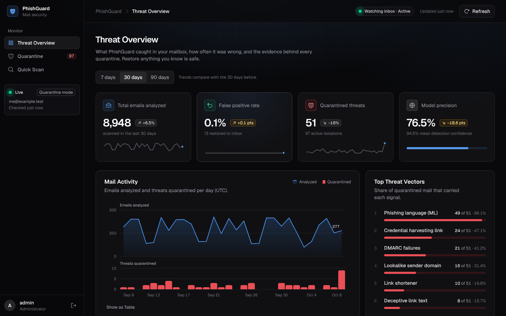
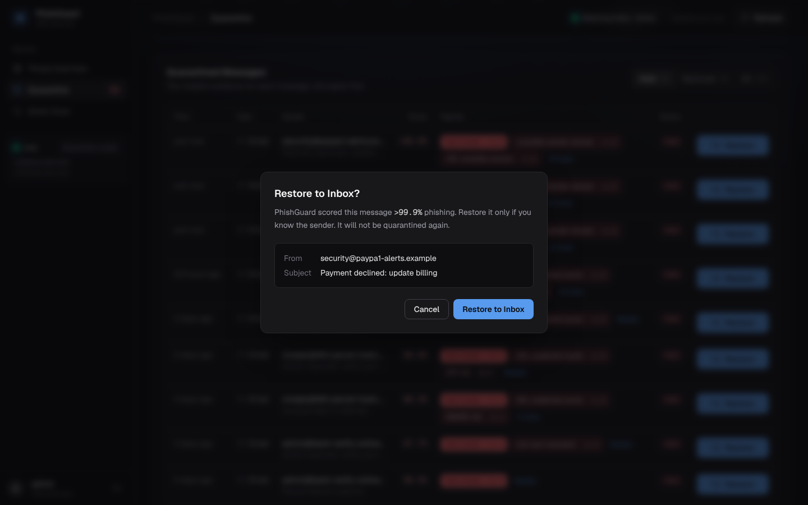
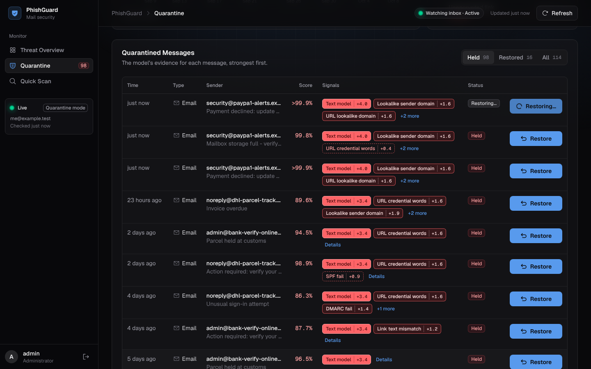
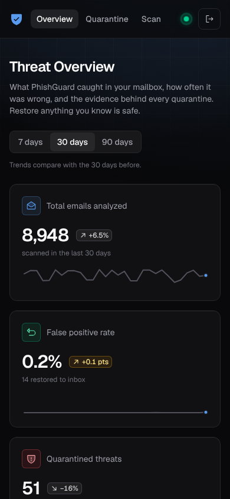

# PhishGuard: AI-Based Phishing Detection Tool

[](https://github.com/Pranavvvv-09/AI-Based-Phishing-Detection-Tool/actions/workflows/ci.yml)

> 🚧 Work in progress: a 10-day build of an explainable phishing detector for email and SMS.

AI has made scams look genuine: phishing emails now have perfect grammar and are
personalised at scale. PhishGuard combines **technical evidence AI can't fake**
(SPF/DKIM/DMARC results, spoofed senders, lookalike links) with a **machine-learning
model of scam intent**. It explains every verdict and can automatically quarantine
phishing from your own mailbox.

## Planned features
- 📥 Automatic scanning of your own Gmail over IMAP, plus `.eml` upload and SMS text
- 🔍 Header checks (SPF/DKIM/DMARC, Reply-To mismatch, display-name spoofing)
- 🔗 URL checks (punycode, IP hosts, `@` tricks, shorteners, link-text mismatch)
- 🤖 TF-IDF + Logistic Regression models for email and SMS
- 💡 Explainable verdicts ("why was this flagged?")
- 🛡️ Reversible quarantine with JSON incident reports and an audit log
- 📊 Login-protected dashboard: quarantined mail with its weighted reasons and a one-click Restore

## Progress
- [x] Day 1: Project setup, secure repo hygiene, config validation
- [x] Day 2: Safe `.eml` parser (size, MIME-bomb, header-flood and charset defences)
- [x] Day 3: Header checks (SPF/DKIM/DMARC trust model, spoofing, lookalike domains, BEC)
- [x] Day 4: URL & attachment checks (punycode, @-trick, obfuscated IPs, link-text mismatch, risky files)
- [x] Day 5: Email ML model (TF-IDF + LogReg on 36k emails incl. 2022–26 honeypot phishing; 87.9% recall on future real phishing; shortcut-learning fixes)
- [x] Day 6: SMS model + explainable scorer (log-odds fusion of text, header, link and trust evidence; 94% of future real phishing flagged, 0.5% of legitimate mail). SMS wording is judged by blending the SMS and email models, chosen by a pre-registered experiment on frozen test sets: genuine bank/OTP/delivery SMS wrongly flagged fell from 37.5% to 20.8%. SMS sender and link-vs-brand evidence plus two capped credits, chosen by a second pre-registered experiment on fresh frozen sets: genuine SMS flagged 17.8% → 11.1% and none at quarantine level, smishing caught 77.8% → 82.2%; 13 Indian consumer brands added (modern genuine email flagged 22.7% → 13.6%, measured post-hoc)
- [x] Day 7: IMAP poller + reversible quarantine (TLS-only, read without marking as read, move never delete, restore that is never undone by the next poll, JSON incident reports, hash-chained audit log; monitor mode opens the inbox read-only)
- [x] Day 8: dark-mode web console started together with the mailbox poller by one command: a React + Tailwind dashboard (quarantine table with colour-coded explainability chips and **Restore to Inbox** with confirmation and a loading spinner, `POST /api/restore/{id}`, real IMAP move, in-place update) and a Quick Scan page for emails and SMS. Verified end to end against a real TLS IMAP server (Dovecot) in a real browser
- [x] Day 9: Tests + CI hardening (GitHub Actions on Python 3.11 and 3.13: ruff, bandit, 369 tests with a 85% coverage floor (92% measured, without the datasets), pip-audit; least-privilege token, SHA-pinned actions, Dependabot; timing tests made CI-safe)
- [ ] Day 10: Docs & release

## Development setup
```bash
python -m venv .venv && source .venv/bin/activate
pip install -e ".[web,dev]"
python scripts/bootstrap.py   # download datasets + train email and SMS models (~7 min first run)
cp .env.example .env          # then fill in secrets (see docs/lab-setup.md)
pre-commit install
```

## Checks (the same ones CI runs)
```bash
ruff check .                                   # lint
bandit -q -c pyproject.toml -r src             # security lint
pytest --cov=phishguard                        # tests; fails below 85% coverage
pip-audit --skip-editable                      # known vulnerabilities in dependencies
```
[`.github/workflows/ci.yml`](.github/workflows/ci.yml) runs these on every push and pull
request, on Python 3.11 (oldest supported) and 3.13. CI has no datasets or trained models:
the few tests that need them skip themselves, everything else uses small stand-in models
and an in-memory IMAP server (`tests/imap_fake.py`), plus one test that feeds real
`imaplib` the exact bytes an IMAP server sends (`tests/test_imap_wire.py`).
The workflow is locked down: read-only token, actions pinned to commit SHAs (kept current
by [Dependabot](.github/dependabot.yml)), no stored credentials, 15-minute timeout.

## Score a message
```bash
python -m phishguard.scorer email path/to/message.eml
python -m phishguard.scorer sms "Your SBI account is blocked. Update KYC at sbi-kyc-update.in/verify" \
    --sender "+91 98301 44728"   # optional: the number, short code or sender ID your phone shows
```
Prints a JSON verdict: `score` (0–1), `label` (phishing / suspicious / legitimate),
`action` (quarantine / review / deliver) and the `reasons`, each with a signed weight
showing how much it moved the score. For SMS, `components` also shows both model probabilities
(`sms_model_probability`, `email_model_probability`), which are averaged in log-odds. SMS also get
their own evidence: a brand-claiming message from a personal number or an email address, links
outside the brand the message names, and two small capped credits (nothing to act on: no link,
number, address or reply request; or every link on the named brand's own domains). A sender ID
like `VM-HDFCBK-S` never earns credit, because outside India sender IDs can be spoofed.
Errors and partly-analysed messages always return `review`, never `deliver`.
Full-system results are in `models/scorer_metrics.json` (reproduce with `python scripts/evaluate_scorer.py`). How the SMS scoring was chosen, including
a leak we found in our own synthetic data and fixed, is in [data/README.md](data/README.md)
(reproduce with `python scripts/sms_experiment.py`; the Day 6 sender/link rules:
`python scripts/rules_experiment.py`).

## Watch your mailbox (Day 7)
```bash
python -m phishguard.poller run --once            # one pass (MODE=monitor: report only)
python -m phishguard.poller run                   # keep polling every IMAP_POLL_SECONDS
python -m phishguard.poller run --once --backfill 20   # first run: also scan the last 20
python -m phishguard.poller list                  # quarantined messages
python -m phishguard.poller restore <incident-id> # move one back to the inbox
python -m phishguard.poller verify-audit          # detect edited or deleted audit lines
```
Start in `MODE=monitor`: the inbox is opened **read-only** and phishing is only reported
as `would_quarantine`. With `MODE=quarantine`, messages scoring at or above
`QUARANTINE_THRESHOLD` are **moved** to `IMAP_QUARANTINE_FOLDER`; suspicious ones are only
reported. Nothing is deleted, marked as read or modified. Reports go to `reports/`
(one JSON per flagged message, no body text, plus `audit.log`); quarantine records go to
`quarantine/`. Setup and safety notes: [docs/lab-setup.md](docs/lab-setup.md).

## Run it (one command)
```bash
pip install -e ".[web]"
python scripts/bootstrap.py        # first time only: data + models
cp .env.example .env               # then fill in the values below
python -m phishguard.web           # open http://127.0.0.1:5000
```
`.env` needs `ADMIN_USERNAME`, `ADMIN_PASSWORD_HASH` and `FLASK_SECRET_KEY` (signs the
session cookie):
```bash
python -c "from werkzeug.security import generate_password_hash as g; print(g('your-password'))"
python -c "import secrets; print(secrets.token_urlsafe(32))"
```
Add `IMAP_USER` and `IMAP_APP_PASSWORD` (a Gmail app password, see
[docs/lab-setup.md](docs/lab-setup.md)) and the same command also starts the **mailbox
poller** in the background: it checks the inbox every `IMAP_POLL_SECONDS` and, with
`MODE=quarantine`, moves phishing to the `PhishGuard-Quarantine` folder.

**Dashboard** (`/`, React + Tailwind CSS, dark mode), one page in three sections that the
sidebar (or the top tabs on smaller screens) slides between:

- **Threat Overview**: four security KPIs for the chosen range (7, 30 or 90 days, kept in
  the URL as `?range=7d`), each with its change against the range before: *Total emails
  analyzed*, *False positive rate* (messages restored to the inbox / analyzed), *Quarantined
  threats* (with the number still isolated) and *Model precision* (quarantined mail nobody
  had to release, with the model's mean confidence). Below them, *Mail Activity* (emails
  analyzed and threats quarantined per day, two aligned panels with one crosshair, plus a
  table view) and *Top Threat Vectors* (the signals found most often in quarantined mail,
  such as phishing language, credential-harvesting links and DMARC failures). The header
  shows a live poller heartbeat ("Watching inbox · Active").
- **Quarantine**: the table: **Time, Type, Sender, Score, Status**, plus **explainability
  chips** for the signals behind each verdict. Red chips push towards phishing, green
  towards legitimate; a solid chip is strong evidence (|weight| >= 2), a tinted one medium
  (>= 1), a dashed one weak; hover or focus a chip for its evidence. "+N more" opens every
  signal with its explanation. **Restore to Inbox** asks for confirmation, shows a spinner
  while the server moves the message back to your inbox over IMAP
  (`POST /api/restore/{id}`), then updates the row and the numbers without a reload.
  Held / Restored / All filters live in the URL (`?status=restored`). A restored message is
  remembered by its content hash, so the poller never quarantines it again.
- **Quick Scan sandbox**: paste an email or SMS and run it through the model on the spot.

Motion is short (250 ms or less), uses only `transform` and `opacity`, and switches off when
the system asks for reduced motion: KPI digits pop in when a number changes, the confirm
dialog scales in over a blurred backdrop, toasts rise from the bottom right, a restored row
fades and slides out of the Held list, the nav indicator slides between sections, and the
poller beacon pings while it is live. The transitions come from the
[transitions.dev](https://transitions.dev) skill (install it with
`npx skills add https://github.com/jakubantalik/transitions.dev --skill transitions-dev`;
it is not committed here because its license does not allow republishing the collection).

**Quick Scan** (`/scan`): the full page also takes an SMS sender or an uploaded `.eml`, and
shows the verdict with every reason.

| Dashboard | Confirm | Restoring | Phone |
|---|---|---|---|
|  |  |  |  |

How it fits together: the dashboard is a small React app in [`frontend/`](frontend/)
(Vite, TypeScript, Tailwind CSS v4, Phosphor icons, Geist fonts). It reads
`GET /api/session` (CSRF token, poller status), `GET /api/quarantine` and
`GET /api/overview?days=30` (daily counts, the totals for this range and the one before,
precision inputs and the top signals), and posts to
`/api/restore/{id}` with the session cookie and an `X-CSRF-Token` header. The built
files are committed to `src/phishguard/static/app/`, so running PhishGuard needs only
Python; CI rebuilds them and fails if the committed copy is out of date. Login and Quick
Scan stay server-rendered (FastAPI + Jinja, htmx for the scan form).

Working on the dashboard:
```bash
cd frontend
npm ci --ignore-scripts      # exact versions from package-lock.json
npm run dev                  # http://localhost:5173, proxies /api to python -m phishguard.web
npm test                     # Vitest + Testing Library
npm run build                # typecheck, then write src/phishguard/static/app/ (commit it)
```

Safety: one login from `.env`; the app won't start with a weak secret key or a plain-text
password; every form and the Restore call carry a CSRF token; login and Restore are rate
limited; only the app's own scripts, styles and fonts may load (strict CSP, no inline
code); every Restore is in the hash-chained audit log. It listens on `127.0.0.1` only;
the web app holds your IMAP app password, so keep it on your own machine. Headless use
without the web page: `python -m phishguard.poller run` (see above).

## Train the model yourself
See **[docs/PhishGuard_Model_Training_Guide.pdf](docs/PhishGuard_Model_Training_Guide.pdf)** (22 pages): both models,
every dataset with links and hashes (plus other public Kaggle/Hugging Face sources you could add), every hand-made
rule with its weight, every threshold, step-by-step commands (Linux/macOS/Windows), the SMS experiment, expected
results and troubleshooting. Its Linux commands were run on a fresh clone and reproduced every number exactly.

## Safety
PhishGuard performs static analysis only and never visits links. Use it only on
mailboxes you own. See [docs/lab-setup.md](docs/lab-setup.md) and [SECURITY.md](SECURITY.md).

## License
MIT. See [LICENSE](LICENSE).
